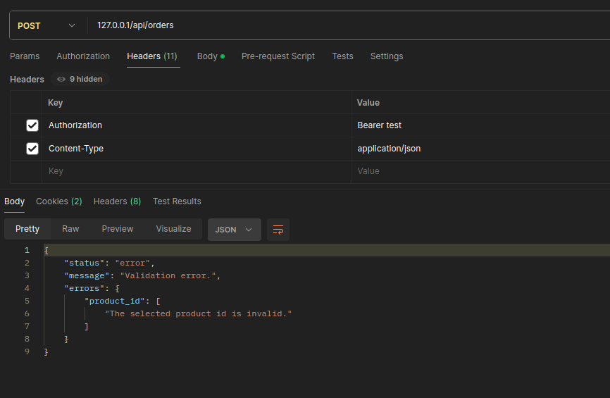

## Особливості
- використовуємо підхід Service-Repository Pattern + DI
- окремий хелпер для відповідей ApiResponse, текст для помилок винесено в ENUM
- кастомні Exception, невідомі помилки логуються, що дозволить в майбутньому адаптуватись і писати нові виключення
- with() для позбавлення N+1
- Event Listener для асинхроних дій
- Seeder з hardcode токена для теста
- Використання поверхневих інтеграційних тестів. В ідеалі потріно на SqlLite тестити з моками з заготовленими текструми
- 404 для незнайдених ресурсів. 403 - виключив, для 2 задачі, щоб не відображати що доступ закритий для конкретного користувача

``` 
  Контролер - Відподає за валідацію, обробки помилок
  Сервіс - Бізнес-логіка
  Репозиторій - Запити до моделі
``` 

====================================================
## Моменти
#### В методі store() 2 задачі - додавання order та вивід попередніх товарів користувача. Для підримки Single Responsibility можна розгялянути розділення
``` 
Приклад:
 - метод store (POST - api/orders) - зберігання даних, вивід, що зберегти 
 - метод index (GET api/users/{user}/orders) - вивід списка по юзеру, з валідацією, що тільки своє бачать

```
#### Метод show(). Варіанти реалізації
``` 
 - Policy-реалізація (для цієї задачі здається перебільшеним)
 - Route model binding show(Order $order) (мінімум дій, валідація в FormRequest але потрібно перевірка на існуючий Order)
 - [Вибір] Через Repository (Вся розробка однакова, через Repository + можливість в майбутньому використовувати DTO або мутувати дані)

```

### API Response Codes (OrderController)

| HTTP Code | Enum                                                                    | Значення                                      | Коли використовується                                                                        |
| --------- | ----------------------------------------------------------------------- |-----------------------------------------------|----------------------------------------------------------------------------------------------|
| `200`     | `SuccessCodeEnum::ORDER_FOUND`                                          | Замовлення знайдено                           | У методі `show`, якщо замовлення знайдено і належить користувачу                             |
| `201`     | `SuccessCodeEnum::ORDER_CREATED`                                        | Замовлення успішно створене                   | У методі `store`, якщо замовлення створене без помилок                                       |
| `404`     | `ErrorCodeEnum::PRODUCT_NOT_FOUND`<br>`ErrorCodeEnum::ORDER_NOT_FOUND`  | Продукт або замовлення не знайдено            | У методі `store` або `show`, якщо ресурс не існує або нема доступу (403 не використовую тут) |
| `422`     | `ErrorCodeEnum::VALIDATION_ERROR`                                       | Дані не пройшли валідацію                     | У методі `show`, якщо передано невалідний `orderId`                                          |
| `500`     | `ErrorCodeEnum::ORDER_CREATED_FAILED`<br>`ErrorCodeEnum::UNKNOWN_ERROR` | Помилка при створенні замовлення або невідомо | У методі `store` або `show`, якщо сталася непередбачена помилка                              |

 403 - стандартна від Laravel Sanctum

## Користування




### Що можна покращити
- Додати laravel Resource
- Додати базувий костомний клас для Exception (наприклад для логів)
- Документація
- Використовуємо DTO для трансферу даних
- Middleware правило, завжди в api повертає json
- Добавти PHPStan та phpCSFixer
- Версіровання API
- Текстовку перенести в lang
- Unit та Feature тести
- Як варіант валідація для існуючих продуктів  'product_id' => ['required', 'integer', 'exists:products,id'] (але тут вже залежить чи потрібно нам більш тонко кастомні помилки робити)


### Міграція
## Токен для тесту зашитий. Заповнюється кожного разу через migrate:fresh --seed

Щоб оновити структуру бази даних та заповнити даними.

``` 
docker-compose run --rm artisan migrate:fresh --seed

```

### Токен для API
```
test 

Authorization: Bearer test 
(працює після сідінгу)

```
## Тест

## Приклад роботі


